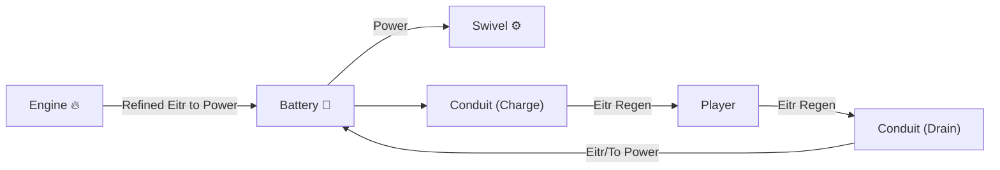

# 🔋 Power System Guide (4.0.0+)

**Automate, connect, and power up your world!**
*ValheimRAFT features a modular Power System to connect engines, batteries,
pylons, and more.*

---

## ⚡ Overview

> The Power System lets you generate, store, transfer, and consume energy to
> automate your vehicles and contraptions.
>
> Use engines to produce power, **batteries** to store it, and **power pylons**
> to link components together!

---

## Core Components

| Component                   | Description                                                                               |
|-----------------------------|-------------------------------------------------------------------------------------------|
| **Power Engine**            | Burns fuel to produce power. Configurable fuel types and outputs.                         |
| **Power Storage (Battery)** | Stores excess power for later use. Can supply connected devices when engines are offline. |
| **Power Pylon**             | Connects power networks across distance. Automatically links nearby sources and storage.  |
| **Conduit Plate**           | Transfers energy to/from the player (e.g., Eitr), or bridges different networks.          |
| **Consumers**               | Anything that uses power (motors, machines, advanced modules).                            |

---

## 🔌 How Power Flows

1. Engines **burn fuel** (wood, coal, etc) and output **Power**.
2. Power flows into **Batteries** or directly to **Consumers** (e.g. engines,
   lights, automation).
3. **Pylons** relay power between distant nodes — just build them close enough
   to link!
4. If power is needed but no engine is running, **Batteries** automatically
   discharge.

---

## 🚀 Getting Started

### 1. Build a Power Source

Current prefabs: `Eitr Source`

- Place a **Power Engine** on your raft or base.
- Add valid fuel (check the tooltip).

### 2. Add Power Storage

Current prefabs: `Eitr Storage`

- Place a **Battery** nearby or connected via pylons for longer distances.
- Batteries store excess energy and help during low-fuel periods.
- Batteries will visually fill and can be inspected for energy and capacity.
- Batteries charge in order of current charge level — highest charge fills
  first.

### 3. Link With Pylons (BETA)

- Place **Power Pylons** to extend your network across long distances.
- Pylons auto-link if within range — no cables required!
- Pylons display electricity arcs to show active connections.

### 4. Power Consumers

Current prefabs: `swivel`

- Place a swivel.
- Configure a switch to target the swivel (
  see [Mechanism Switch](#mechanism-switch) below).
- With a power network and charge present, clicking activate rotates or moves
  the swivel.

### Mechanism Switch

The main controller for all mechanisms.

- Opens the vehicle debug menu by default.
- Can open the swivel toggle menu.
- Configures any single swivel within 50 meters. The swivel must be in a powered
  area.
- Does not directly require power, but swivels require power to activate by
  default.

---

## Power Network Diagram

